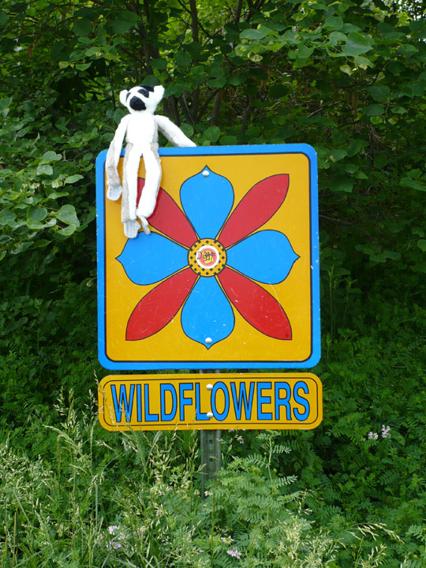
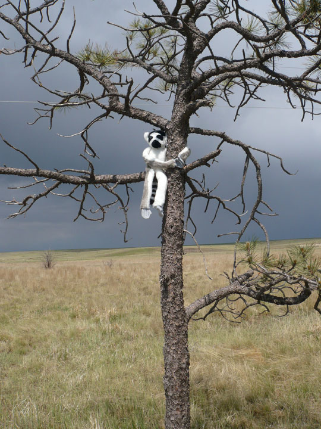
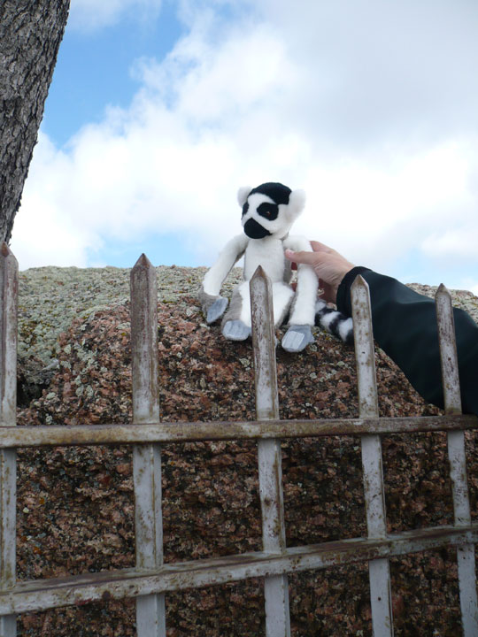
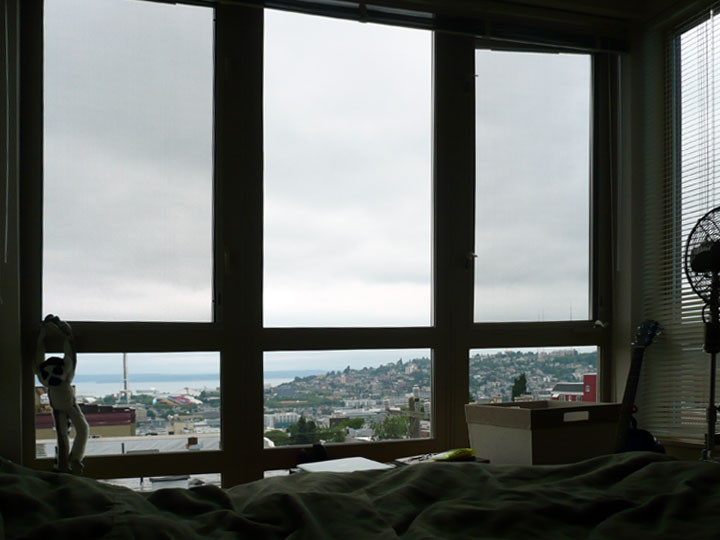

so hans donated some money to [the madagascar fauna group](http://www.savethelemur.org/), [mike lee](http://www.atomicwang.org/motherfucker/Index/Index.html) sent us a lemur, and then we photographed the lemur [named carnegie] traveling across the country with us to our new home in seattle.  
  

  
this is us saying goodbye to the turtles in saint louis, missouri.  
  

  
carnegie without his humans, playing with the turtle.  
  

  
carnegie on a wildflower sign in kansas.  
  

  
carnegie on a tree in kansas. there's foul weather brewing.  
  

  
carnegie in boulder, colorado.  
  

  
carnegie on a [rock](http://www.roadsideamerica.com/tip/11660) in wyoming.  
  

  
carnegie in front of the temple in salt lake city, utah.  
  

  
carnegie [craving potatoes] in idaho.  
  

  
carnegie in portland, oregon.  
  

  
carnegie in his new home, seattle, washington.
