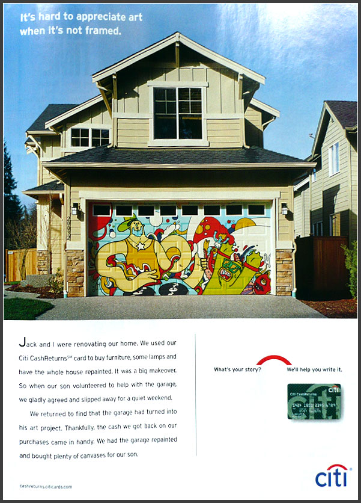

"we returned to find that the garage had turned into his art project. thankfully, the cash we got back on our purchases came in handy. we had the garage repainted and bought plenty of canvases for our son."

are they trying to market towards the insensitive parent crowd? or just those who don't appreciate art? they certainly aren't trying to be loved by any west coast creatives, where street art is the dominant form of self-expression.

the ad should end with "here son, enjoy your consolation canvases. we painted over your masterpiece with easter lily white."
