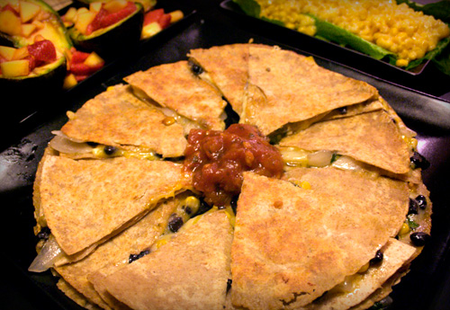

i'm sticking with my new sunday tradition, though this post is nearly a week late. last weekend, i tried out two new recipes, [grilled avocado with strawberry-mango salsa](http://www.epicurious.com/recipes/food/views/Grilled-Avocado-with-Strawberry-Mango-Salsa-235220) and [sweet corn cake](http://allrecipes.com/Recipe/Sweet-Corn-Cake/Detail.aspx). the corn cake was a little off in consistency, though tasty enough that i'll give it another try. these sides accompanied a tasty quesadilla filled with black beans, cilantro, yellow tomatoes, onions, garlic, corn and pepper jack.

