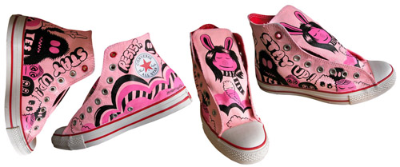

i am generally unimpressed with the whole [(product)red](http://en.wikipedia.org/wiki/Product_RED) thing. it's a brand whose meaning was lost in its execution; a supposedly charitable project that receives more criticism than praise.  take mark rosenman, for example, who describes product(red) as an "example of the corporate world aligning its operations with its central purpose of increasing shareholder profit, except this time it is being cloaked in the patina of philanthropy."

but then converse jumped on the opportunity with their project [1hund(red)](http://www.converse.com/#100ArtistsRed), in which one hundred artists design one hundred pairs of shoes. with artists like [camilla engman](http://www.camillaengman.com/) and [jeremyville](http://jeremyville.com/) on board, it seems inevitable that i will partake. 

