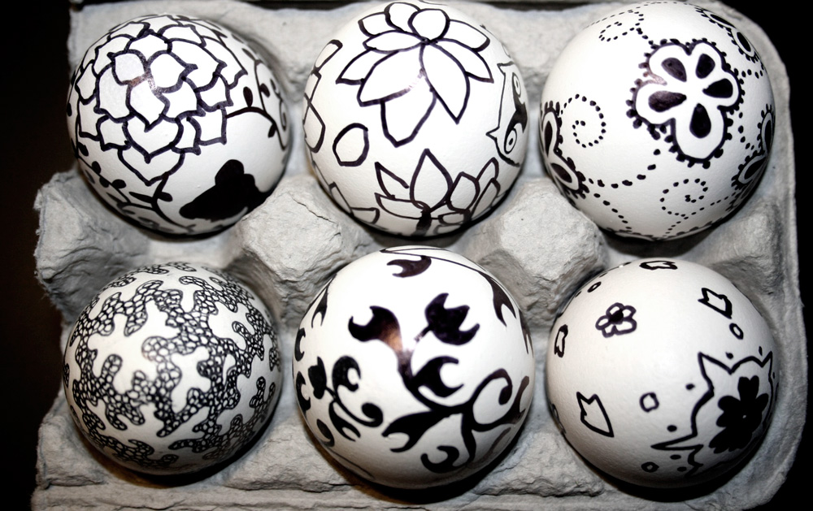

in celebration of the first sunday following the first full moon following the ecclesiastic vernal equinox, hans and i have [once again](http://www.shannonethomas.com/words/2008/03/23/colour-and-pattern-and-eggs.html) decorated eggs.

and with all of the wedding planning on my mind, i simply couldn't help myself.

