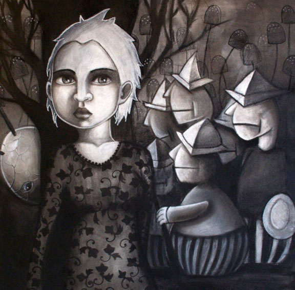

the lesser known alice will be showing for a month at [zero zero](http://zerozerohair.com/), with a closing reception thursday, 9 july.

as i wrap up the pieces, my mind churns with thought. by monday's install, i will have completed a series of sixteen drawings and nearly twenty framed sketches for this show. the equation looks something like this:

**two months - forty plus hours per week - wedding planning time = studio time**

pushing myself for this show has done nothing but raised my ambition, which mostly takes away from my time sleeping, but also leaves me little time to enjoy seattle's beautiful weather. along with the drawings for 'through the looking glass', i'm also working on a piece for a show in portland and five more for one in texas [dfw]. exhausting, perhaps, but more invigorating than anything.

as if the pending deadlines weren't enough, i'm also experimenting with acrylics and custom toy painting, both together and separately. more on that soon. 

for now i must hide the charcoal stains and assume my secret identity.

