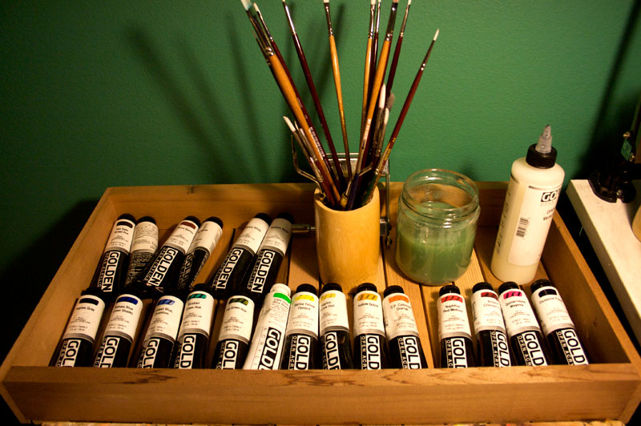

i'm making the switch from oils to acrylics. i'm using [golden's open acrylics](http://www.goldenpaints.com/products/color/open/index.php), which are supposed to simulate the feel of oils, but fall short. everything from the fluidity to the smell is off.

but there are upsides. paintbrushes can now be cleaned with water instead of turpentine, and the lack of authentic smell also means a lack of the bad-for-my-brain chemicals. this is also a benefit for the cat and the husband who often accompany me in the studio. 

my favourite feature is the unbelievably fast dry time. there's no next-day stickiness, even with sap green and yellow ochre. most of it is even dry enough to work on top of within several hours, and i'm finishing smaller paintings in record time. i have yet to take on any large scale pieces with the acrylics, but imagine that will be the ultimate test. until then, i'm hanging onto my gamblin oils, just in case.

