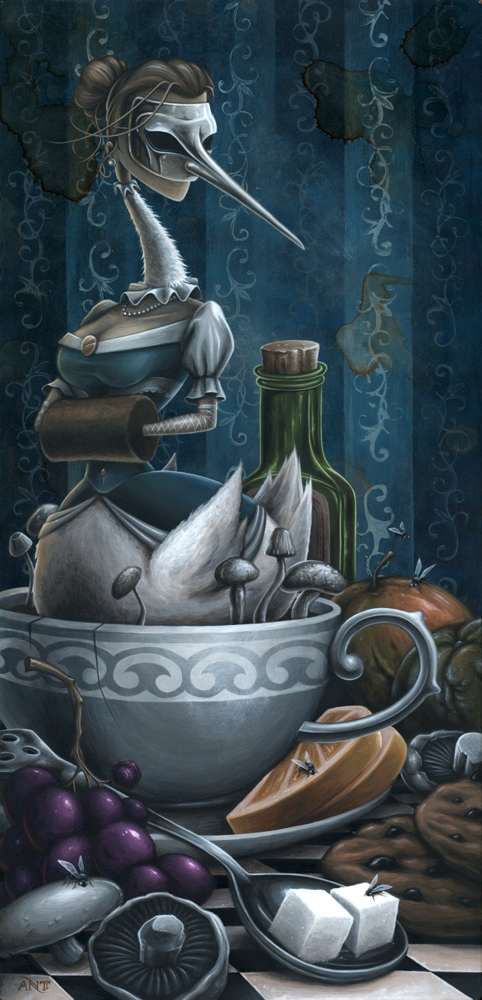

i'm completely in awe of [anthony clarkson's](http://www.anthonyclarksonart.com/wordpress/) work for his show "a time to forget." from the distorted figures to the abundant symbolism, his work has me wanting to drop my macbook and rush into the studio. the images portray dark stories that would take most artists multiple frames to depict, and the eye never tires of wandering. while his earlier work feels akin to the imaginings of [jhonen vasquez](http://en.wikipedia.org/wiki/Jhonen_Vasquez), these new pieces, while still paying tribute to the world of comic, effortlessly incorporate traditional figure and still life painting. absolutely delightful.
