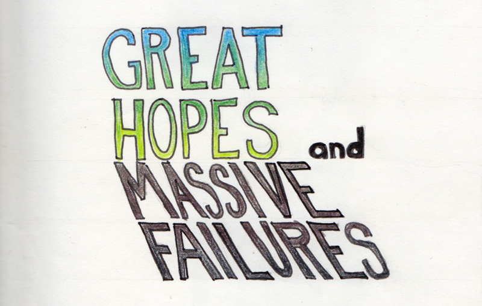

after a fun run with my first [sketchbook project](/2009/03/07/sketchbook-project.html), i decided to do it again. this time, giving myself more time and loftier expectations. 

great hopes and massive failures.

actually, that's not quite how it turned out, though i did wait until less than a month before the deadline to get serious about my sketchbook. though i did abandon the studio for those three weeks while i hurried to get the sketchbook coloured and captioned. though i did rush to the post office on the last possible day of postmarking.

this sketchbook was indeed a step forward from my previous project, and it was an exercise in story telling [both verbal and visual] that bent my brain in exciting ways, tickling my inner surrealist, who waits for my return to the canvas, where she'll take the brush to churn out something amazing.

now i rush back into the studio to let the wild rumpus start. please take the time to explore [the sketches](/sketch/great-hopes-and-massive-failures.html). 

