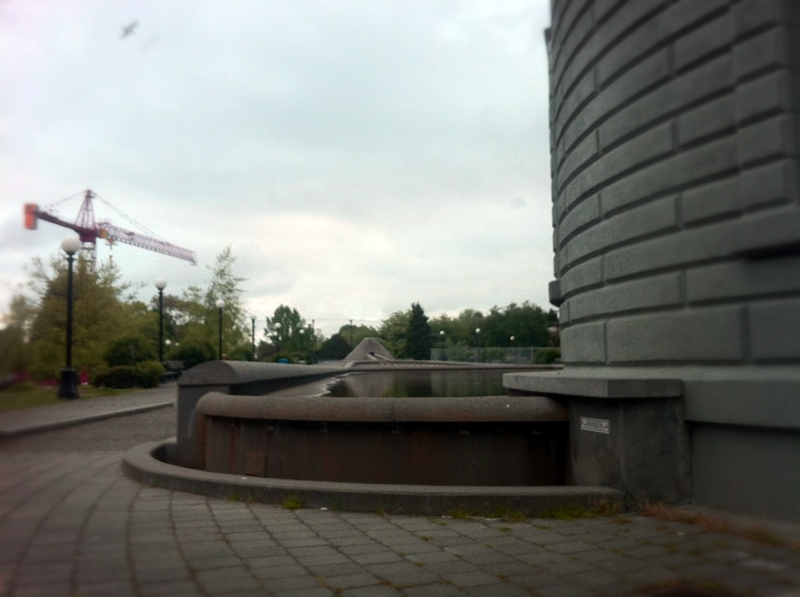
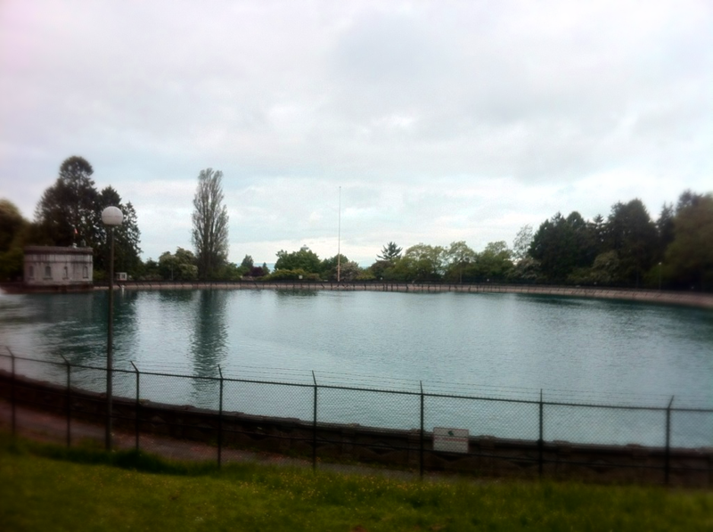

I've taken up a new hobby. Running. The last time I ran was sixth grade cross country, and back then, the mile was considered a long distance run. Years later, I tried again, and only managed a few blocks before my lungs and heart begged me to stop.

For a number of reasons, I decided to give running another chance. A couple of months ago, I bought running shoes, set up a Nike+ account, and began training. My first few runs were much like the previous time I'd tried—only a few blocks and I was walking and cursing myself for this new hobby. A month later, I ran my first 5k, and three weeks after that, my first 10k.

After pushing myself to a place where I finally feel comfortable calling myself a runner, I am able to enjoy the scenery. My runs have adjusted accordingly, and I now visit three parks as I make my way around Capitol Hill. A quick run through Louisa Boren Park gives me a view of the sunrise (or more often fog) over Lake Washington; a jaunt through Volunteer Park reveals all sorts of wildlife, from groundhogs to heron; and then there's the fountains of Cal Anderson Park. On my way home, I make a second trip through Volunteer Park, revisiting the koi ponds and view across the reservoir.

