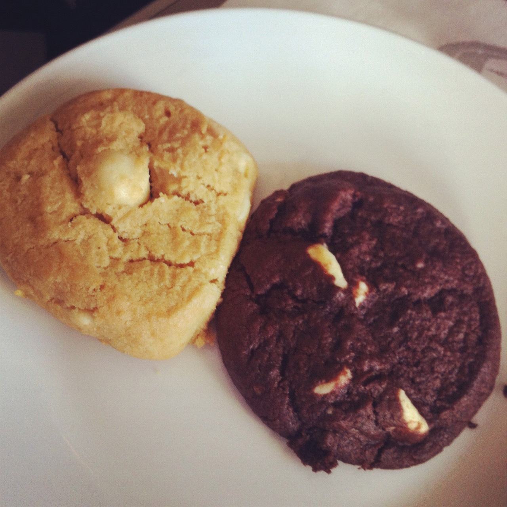
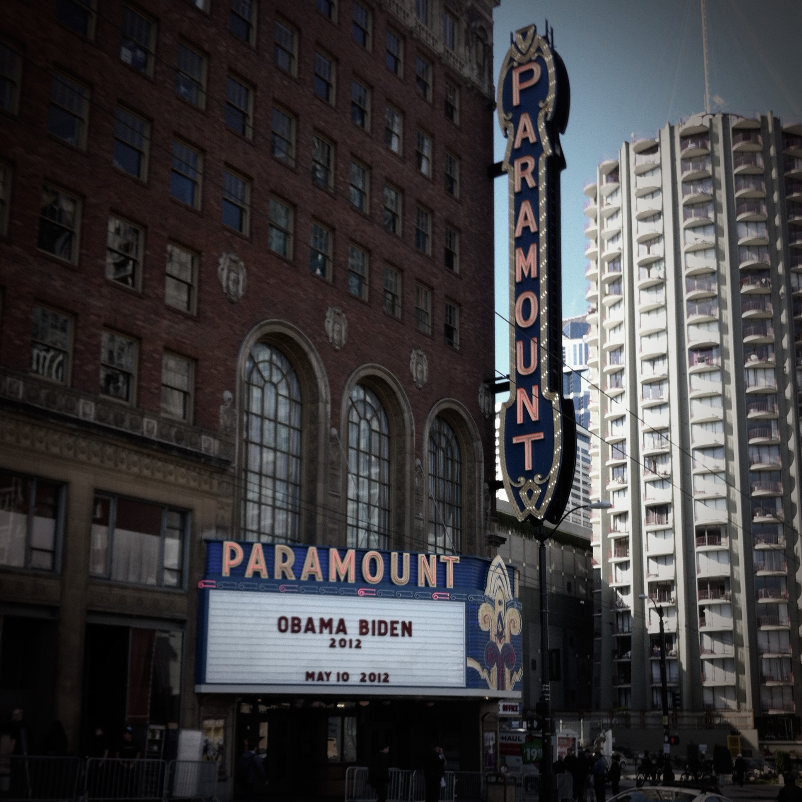
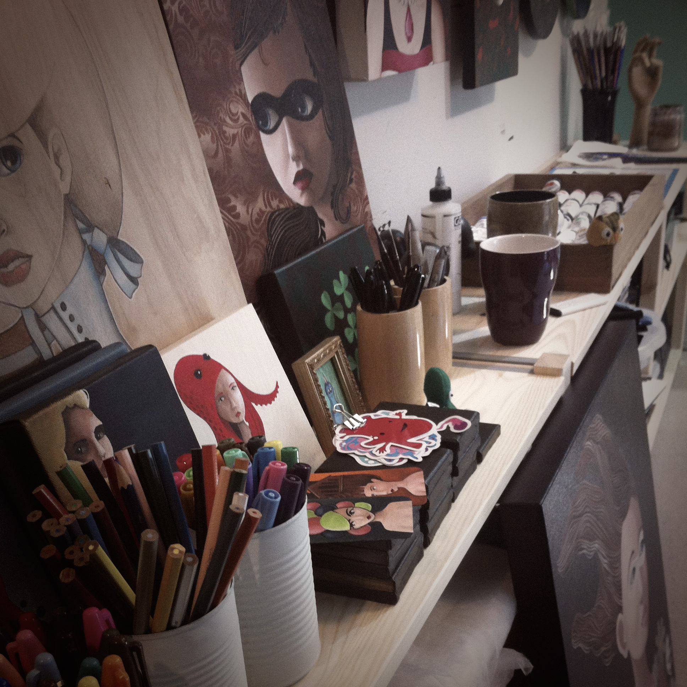

I was rummaging through the photo library on my phone, trying to dig up some old image, when I realized just how many photos I take and often never share. Of course, there's [instagram](http://instagr.am/p/KkontcD20k/), but it's not browsable in the least.

So I've decided to start posting my photos here, along with any relevant adventures that happen along the way.

Last week began in St. Louis, where I found this tragic shot whilst strolling the streets of downtown. 

The middle of the week was spent in Minneapolis. The flight home was made more bearable with a bump to first class, complete with warm cookies and sunset clouds.

Tuesday marked the passing of a [hero](http://en.wikipedia.org/wiki/Maurice_Sendak). The artist at City Market also had heavy boots.

Obama visited Seattle, closing off part of my morning commute. I snapped this shot somewhere between him coming out in favor of gay marriage (hooray!) and the commotion of his visit.

We've been doing quite a bit of work on both the studio and the garden, but hectic weeks of travel have prevented me from enjoying either. Finally, at the week's close, I found the time to enjoy both.

