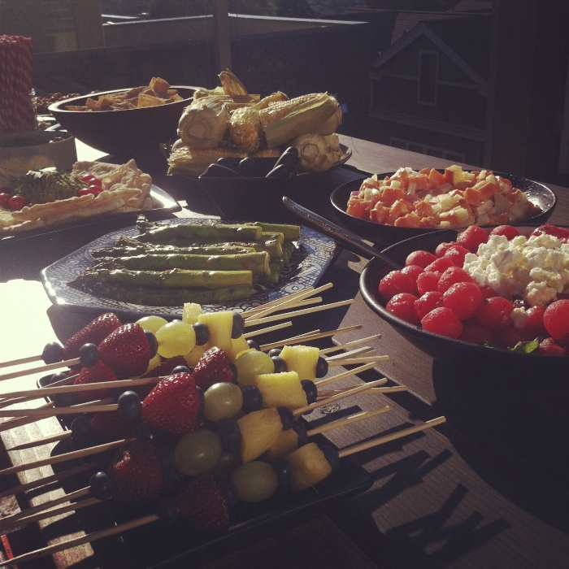
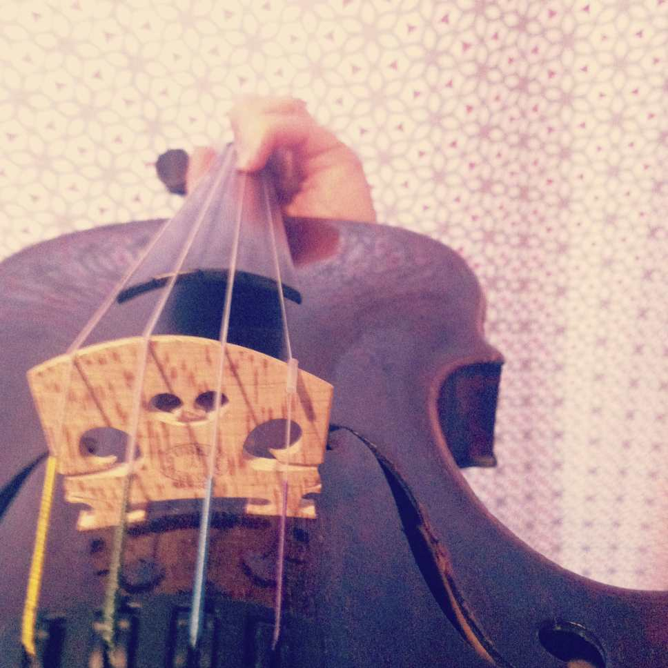

July was a month of tasty harvests, first peas followed by cherries.

We had a small gathering on the fourth, which gave me the opportunity to test out some fresh recipes.

A couple of co-worker-friends and I designed a book, then folded, drilled, and bound sixteen of them.

Most memorably, I ran Ragnar in pink flashing EL wire and a tutu.

I took photos of Shea, inspired by the famous [henri](http://www.youtube.com/watch?v=Q34z5dCmC4M).

And continued making art and playing the violin as usual.

