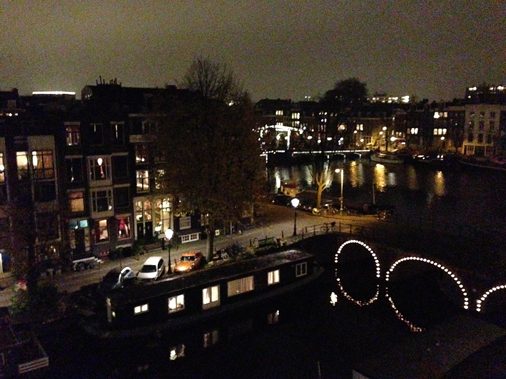
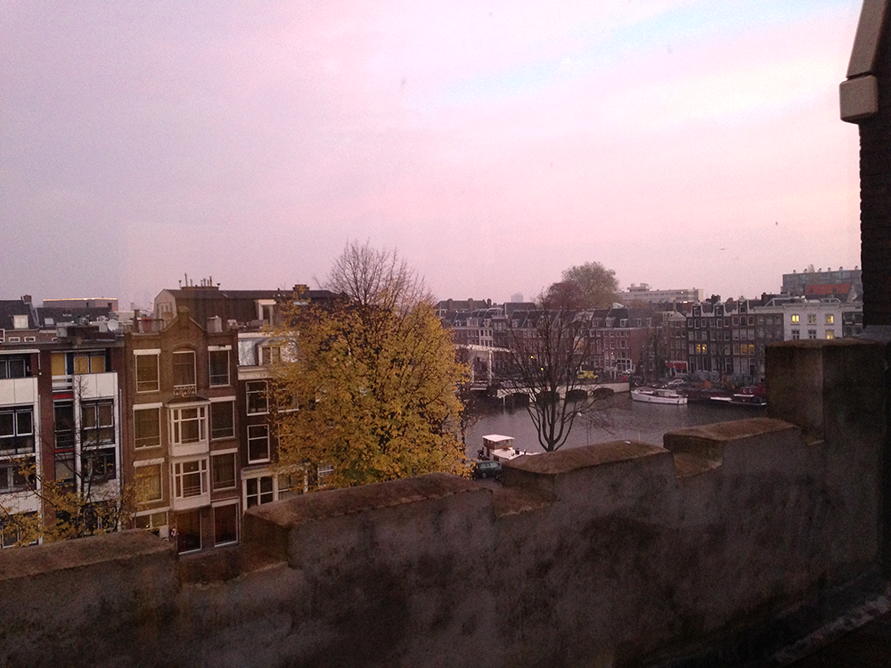

It's not quite been a week since I arrived in Amsterdam. I've spent most of that time suffering from jetlag, and just under half enjoying my apartment's view of Prinzengracht and the Amstel. I've had pannekoeken and gluhwein whilst watching Sinterklaas and Zwarte Piet float up the Amstel. I've gotten lost on my bicycle and performed skirt-guard maintenance in the dark. I've filled my refrigerator with organic groceries and become proficient in dutch-food (kaas is cheese, oude kaas is better cheese). I've been asked for directions and used my bike bell to curse tourists who let their rollerbags linger in the bike path. It's beginning to feel like home.

