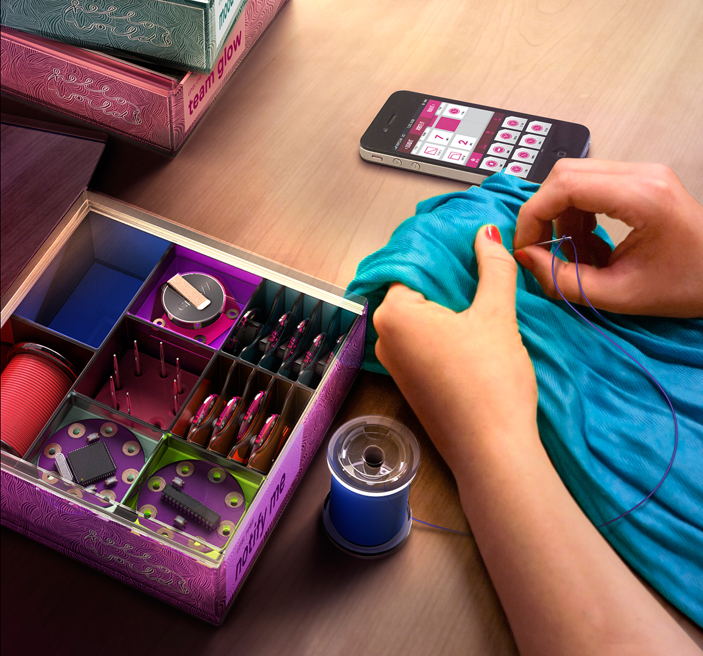
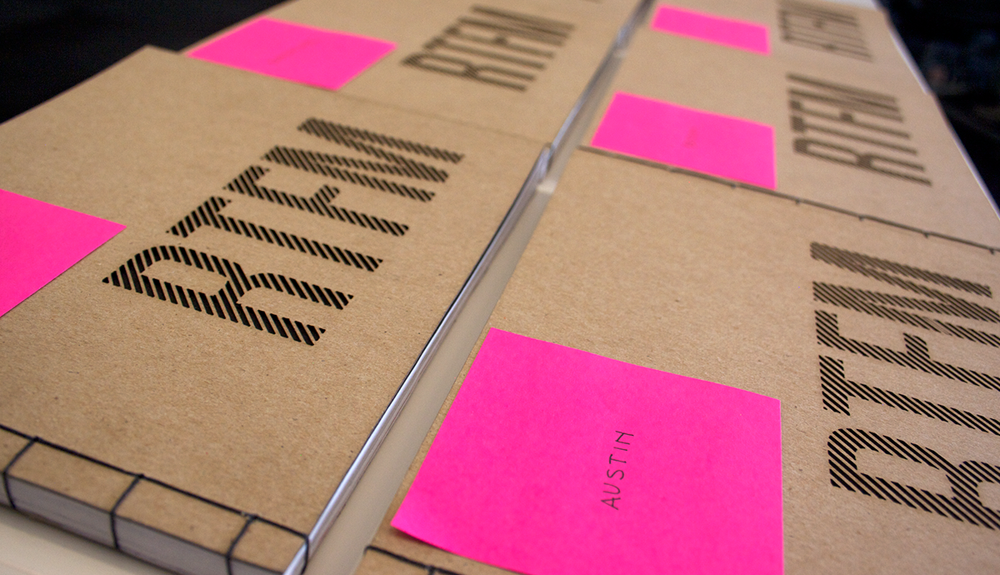

> Eleanor: Goodbye, Steve. 
Steve: Don't say that, even if it's true. Don't say that. It's too painful. 
Eleanor: What do you want me to say. 
Steve: Say "bon voyage."

– The Life Aquatic

Three years ago, almost to the day, I joined [frog](http://www.frogdesign.com/). First in Munich, then in Seattle, and most recently, Amsterdam. It's been a good journey indeed.

We made a lot of things we couldn't talk about, and a few things we could:

We made posters, pamphlets, exhibits, and books:
 

We even made a space to make things:

Bon voyage, friends, until we meet again:

