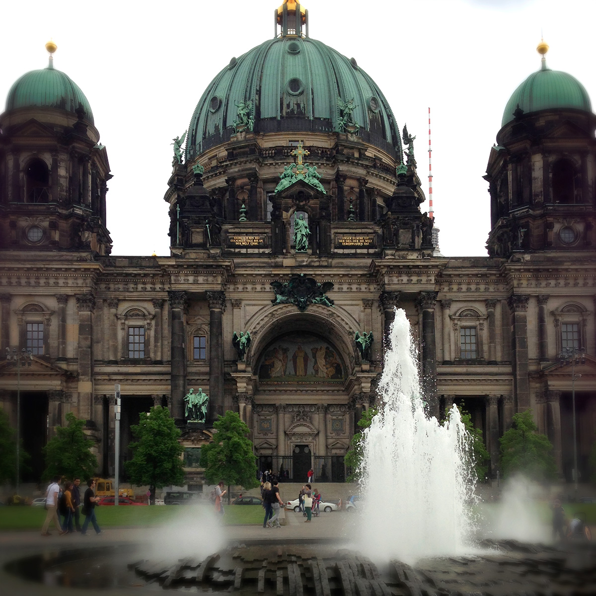
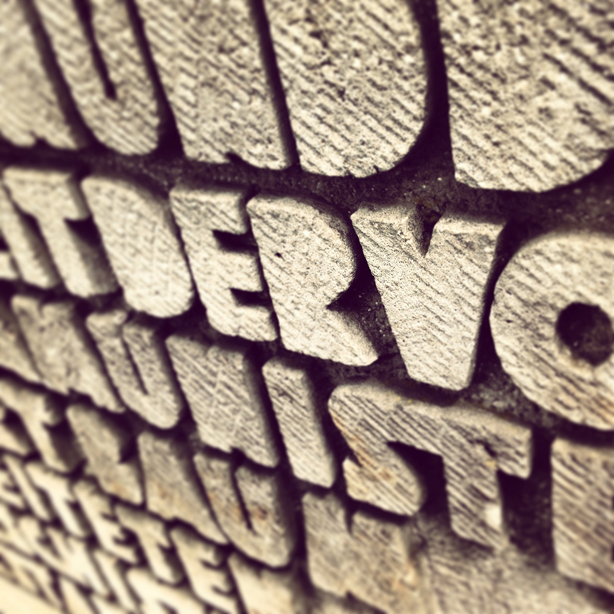
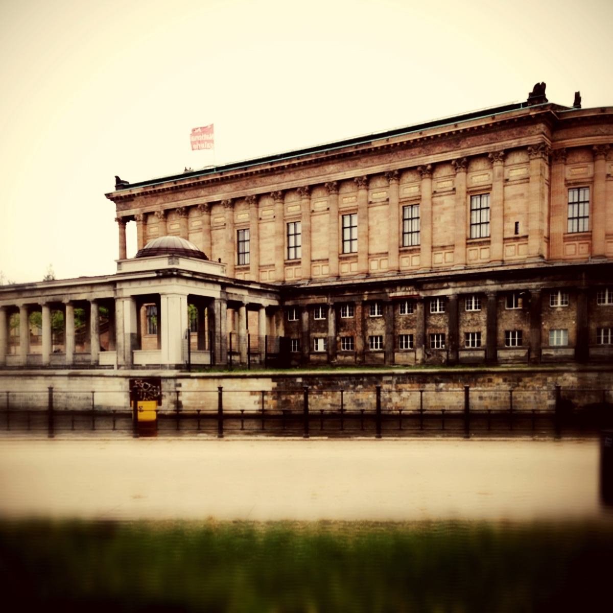
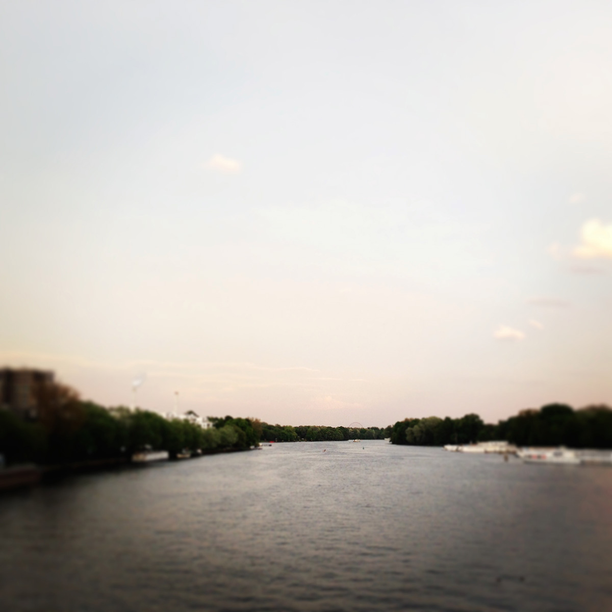
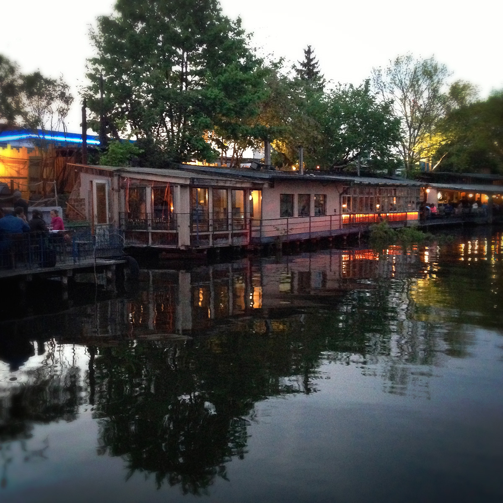
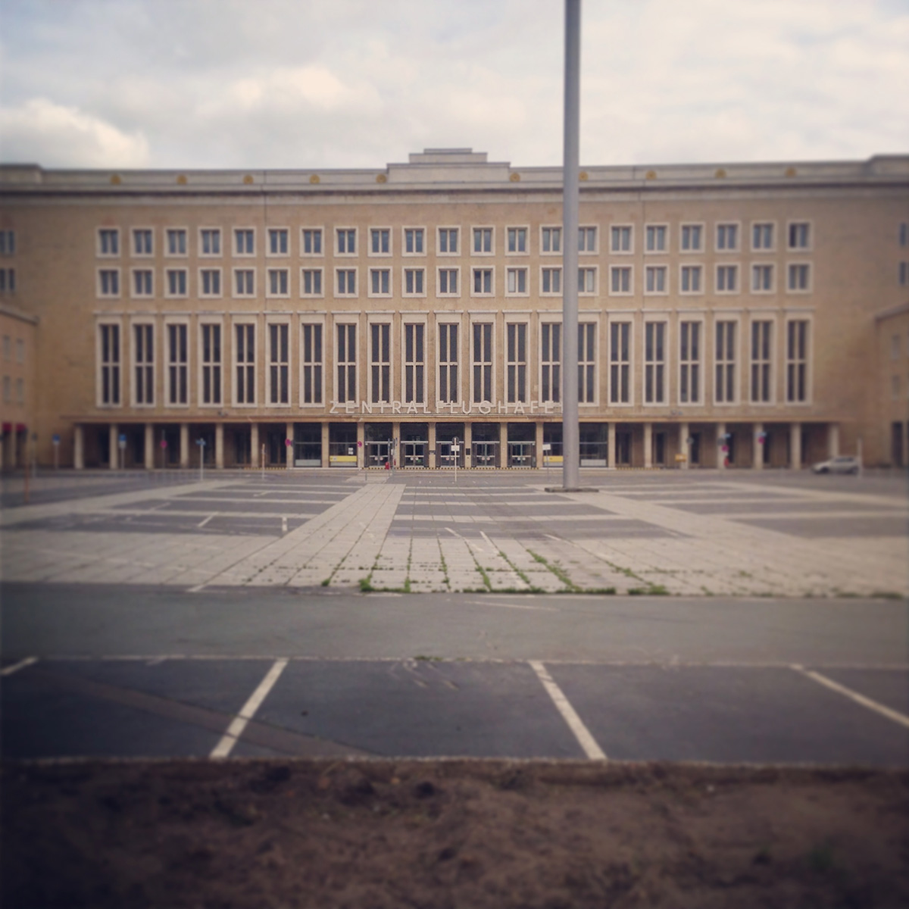

After years of hearing how much we'd love the city, we finally made our way to Berlin.

**DAY ONE: **
We decided to take it easy and take the train. It's a six hour ride from Amsterdam to Berlin, and this time of year it's quite lovely with fields filled with yellow blooms. We stayed with a friend in the East, near Frankfurter Allee. I wasn't quite prepared for the scale of the city or for the somber Soviet architecture.

**DAY TWO: **
We walked over an hour from where we were staying to the center of the city, still awed by the scale and the stark juxtapositions of grandeur and neglect. We went to Museums Island and explored the Alte Nationalgalerie before finding some vegan Vietnamese for lunch. We didn't realize until later that Berlin has a large Vietnamese population because of their shared Communist histories.

We relaxed the afternoon away, and decided to take another walking adventure in the evening. We got lost, and explored some lonely streets with colorful, twisted murals. Stopping at small bars and here and there, we made our way south, over the river and into Kreuzberg, the neighborhood we most often found ourselves in.

**DAY THREE: **
We headed south again to Kreuzberg to enjoy an outdoor brunch. On our way, we happened upon a Turkish market full of fabrics, foods, and artists.

We spent the afternoon wandering along the remains of the Berlin Wall, which is more of an overly-crowded outdoor graffiti gallery. [wall photo by [Hans](http://hans.gerwitz.com)]

**DAY FOUR: **
We visited Mauerpark with its famous flea market and karaoke. We took in a brief bit of morning sunshine before heading to see the art at the [me Collector's Room](http://www.me-berlin.com/). It was a gallery of just the right size with an exhibit of contemporary works inspired by artists like Hieronymus Bosch and Pieter Bruegel – just my cup of tea!

**DAY FIVE: **
Day five we visited the Bauhaus-Archiv. I'm typically unimpressed by the audio tours offered by museums, but highly recommend this one. After our lesson on the creations and motivations of the Bauhaus, we took a stroll through the Tiergarten on our way to lunch.

We spent the afternoon at Flughafen Berlin Tempelhof, an airport no longer used for airplanes. The fields were full of people flying kits and the runways with people on bicycles. 

**DAY SIX: **
We spent our last morning in Berlin at the Neue Nationalgalerie, designed by Bauhaus architect Mies van der Rohe, enjoying pieces by the usual suspects — Picasso, Klee, and Rothko, to name a few. 

And then there was nothing left to do, but catch the train back home.
